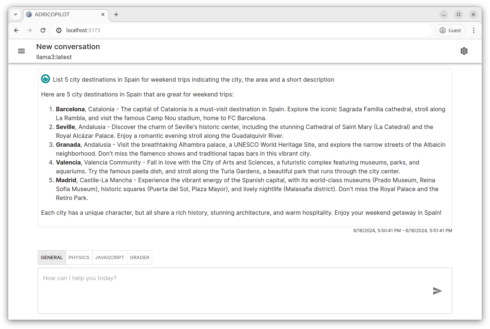
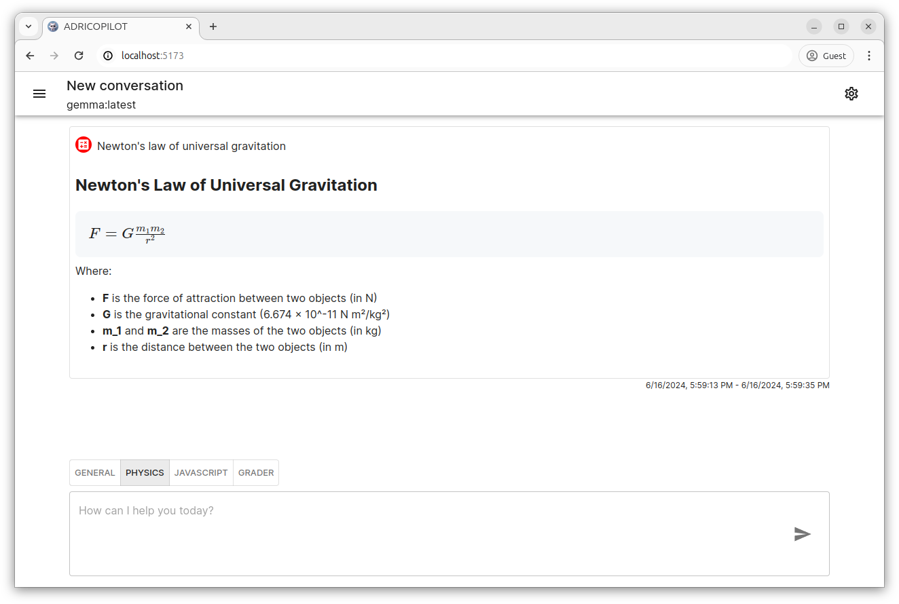
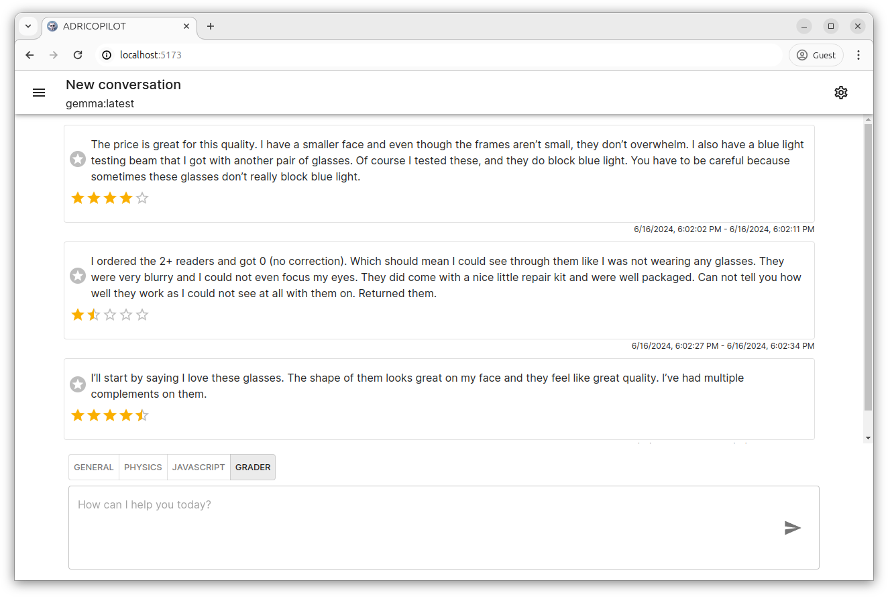
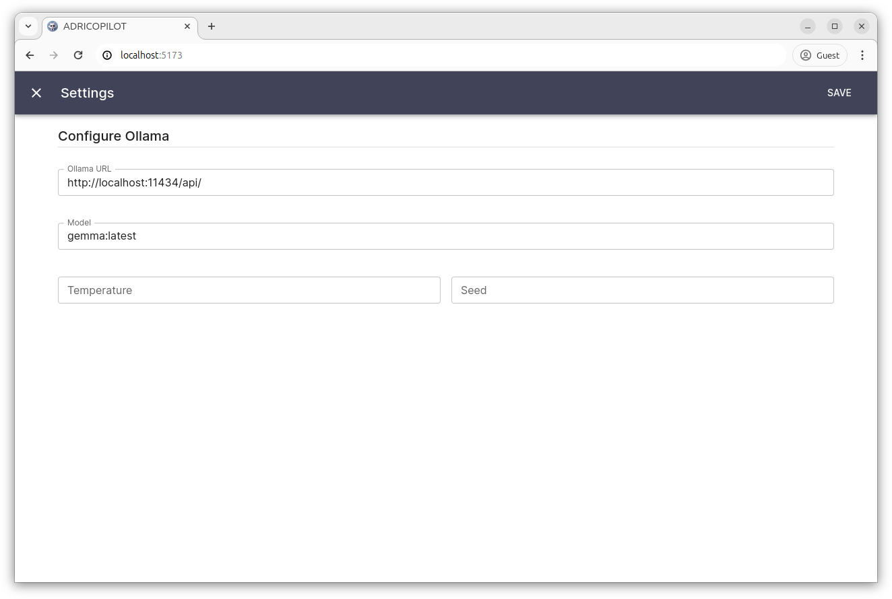

# ADRICOPILOT

ADRICOPILOT is an experiment of a LLM application inspired on other IA chat tools. It requires [Ollama](https://www.ollama.com/) running.

# Screenshots

## General mode



## Physics mode



## Grader mode



## Settings



# Execute ADRICOPILOT from sources

Clone the repository and start. You will need and node and yarn installed first.

```
git clone https://github.com/adrianromero/adricopilot
cd ./adricopilot
yarn install
yarn dev
```

# License

ADRICOPILOT is licensed under the GNU General Public License, Version 3, 29 June 2007.

Copyright (C) 2024 Adrián Romero.
